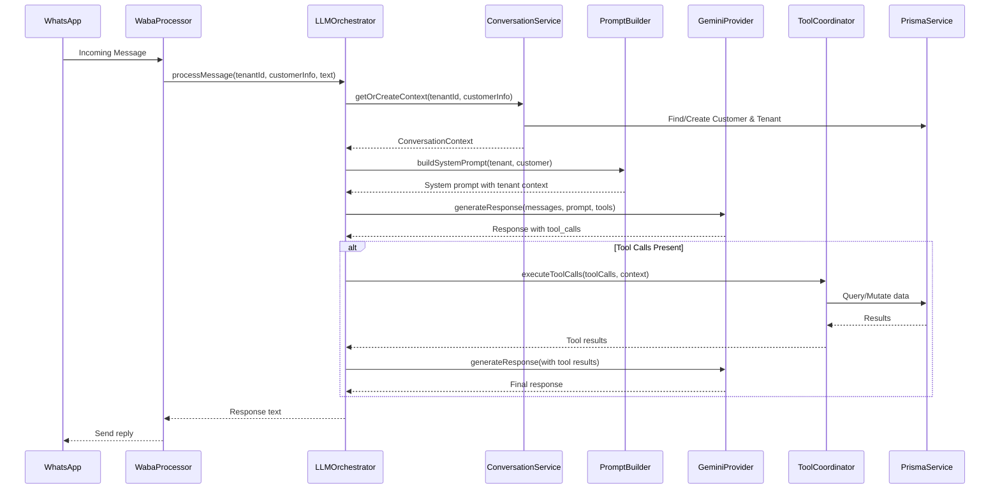

# Data Flow & Integrations

Explain how data enters, moves through, and exits the system, including interactions with external services.

## Module Dependencies
- **AI Module**: Depends on `PrismaModule` for database access
- **WABA Module**: Depends on `AIModule` for message processing
- **Payments Module**: Depends on `PrismaModule`, integrates with Mercado Pago

## Service Layer
- [`AppService`](apps/backend/src/app.service.ts#L4)
- [`TenantsService`](apps/backend/src/tenants/tenants.service.ts#L15)
- [`TenantSaasService`](apps/backend/src/tenants/tenant-saas.service.ts#L18)
- [`TenantMpAuthService`](apps/backend/src/tenants/tenant-mp-auth.service.ts#L7)
- [`SubscriptionsService`](apps/backend/src/subscriptions/subscriptions.service.ts#L11)
- [`SubscriptionBillingService`](apps/backend/src/subscriptions/subscription-billing.service.ts#L4)
- [`CustomerSubscriptionService`](apps/backend/src/subscriptions/customer-subscription.service.ts#L6)
- [`ServicesService`](apps/backend/src/services/services.service.ts#L12)
- [`SaasPlansService`](apps/backend/src/saas-plans/saas-plans.service.ts#L8)
- [`PrismaService`](apps/backend/src/prisma/prisma.service.ts#L6)
- [`PlansService`](apps/backend/src/plans/plans.service.ts#L8)
- [`PaymentsService`](apps/backend/src/payments/payments.service.ts#L10)
- [`PaymentPreferenceService`](apps/backend/src/payments/payment-preference.service.ts#L14)
- [`MercadoPagoService`](apps/backend/src/payments/mercadopago.service.ts#L10)
- [`MercadoPagoWebhooksService`](apps/backend/src/payments/mercadopago-webhooks.service.ts#L6)
- [`OperatingHoursService`](apps/backend/src/operating-hours/operating-hours.service.ts#L7)
- [`CustomersService`](apps/backend/src/customers/customers.service.ts#L12)
- [`CalendarsService`](apps/backend/src/calendars/calendars.service.ts#L7)
- [`TokenService`](apps/backend/src/auth/token.service.ts#L17)
- [`AuthService`](apps/backend/src/auth/auth.service.ts#L9)
- [`TenantCustomerService`](apps/backend/src/appointments/tenant-customer.service.ts#L5)
- [`SchedulingService`](apps/backend/src/appointments/scheduling.service.ts#L8)
- [`AppointmentsService`](apps/backend/src/appointments/appointments.service.ts#L17)

### AI Services (NEW)
- [`LLMOrchestratorService`](apps/backend/src/ai/services/llm-orchestrator.service.ts) - Main AI orchestrator
- [`ConversationService`](apps/backend/src/ai/services/conversation.service.ts) - Context management
- [`PromptBuilderService`](apps/backend/src/ai/services/prompt-builder.service.ts) - Tenant-aware prompts
- [`ToolCoordinatorService`](apps/backend/src/ai/services/tool-coordinator.service.ts) - Tool execution
- [`AIAnalyticsService`](apps/backend/src/ai/services/ai-analytics.service.ts) - Usage tracking

## High-level Flow

Information flow is primarily driven by three external triggers: **Web Application Users**, **WhatsApp Messages (WABA)**, and **Payment Notifications (Mercado Pago)**.

### Primary Pipelines:

1. **The AI Booking Pipeline (NEW)**:
   - `WabaController` receives message → Pushes to `WabaQueue` → `WabaProcessor` extracts tenant & customer → `LLMOrchestratorService.processMessage()` → AI with tools: `CheckAvailabilityTool`, `ListServicesTool`, `BookAppointmentTool` → Natural language response → WABA REST API

2. **The Booking Pipeline**:
   - `WabaController` receives a message -> Pushes to `WabaQueue` -> `WabaProcessor` parses intent -> `SchedulingService` checks availability -> `AppointmentsService` creates the record -> `MercadoPagoService` (optional) generates a payment link -> Response is sent back via WABA REST API.

3. **The Payment Fulfillment Pipeline**:
   - `WebhooksController` (MP) receives notification -> Pushes to `PaymentQueue` -> `PaymentQueueProcessor` validates payload -> `PaymentsService` updates the `Payment` and corresponding `Appointment`/`Subscription` status.

4. **The Tenant Onboarding Pipeline**:
   - Frontend UI -> `TenantsController` -> `TenantSaasService` -> `MercadoPagoService` (OAuth) -> `PrismaService` (Write) -> Frontend redirect to config dashboard.

5. **The Dashboard Data Pipeline (NEW)**:
   - `Dashboard Page` → `useDashboard` hook → `apiClient` → Backend API → React Query cache

## AI Message Processing Flow (NEW)

## Internal Movement

- **BullMQ**: Used for decoupled processing between controllers and heavy logic (WABA parsing, MP notifications).
- **Global Prisma Instance**: Shared database access ensures ACID compliance across modules.
- **Shared Types**: `packages/api-types` ensures that frontend and backend agree on the payload structure.
- **AI Context**: In-memory conversation context with database-backed customer/tenant data.

## External Integrations

### 1. Google Gemini (NEW)
- **Purpose**: LLM for natural language understanding and response generation
- **Authentication**: API key via `AI_DEFAULT_MODEL` environment variable
- **Retry Strategy**: Exponential backoff with max 3 retries

### 2. WhatsApp Business API (Meta)
- **Purpose**: Messaging channel for customer interactions
- **Authentication**: Access token per tenant
- **Payload**: Webhook format with message content

### 3. Mercado Pago
- **Purpose**: Payment processing and subscription billing
- **Authentication**: OAuth 2.0 for tenant authorization
- **Webhook**: Signature validation required

## Observability & Failure Modes

- **Retries**: BullMQ is configured with exponential backoff for WABA and Payment processing.
- **Idempotency**: `externalId` check (from MP or WABA) prevents duplicate processing of the same event.
- **Validation**: `class-validator` at the controller level rejects malformed external payloads before they reach the service layer.
- **AI Analytics**: Token usage tracking for cost monitoring and optimization.
