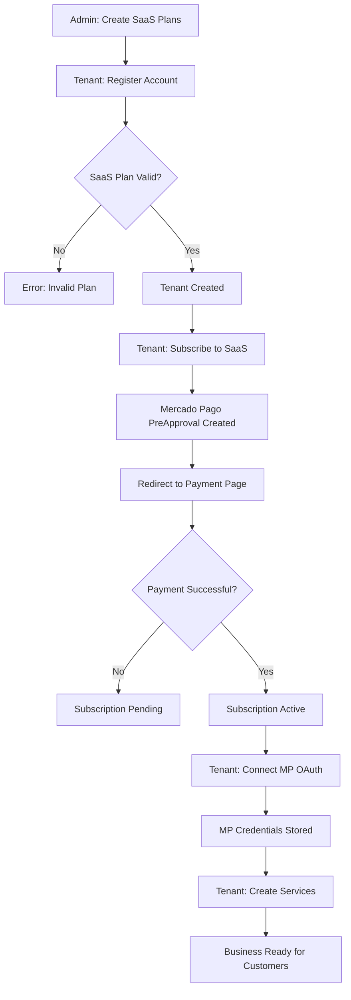
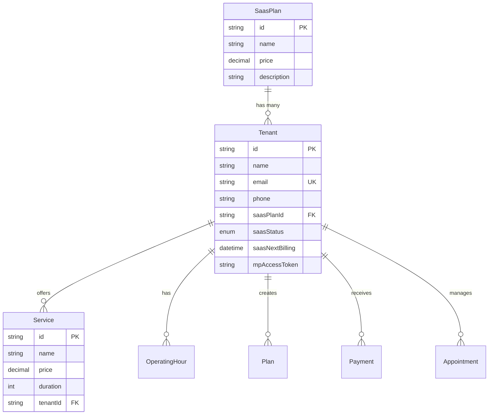

# Tenant Onboarding Flow

This document explains the complete onboarding process for a tenant (business owner) in the WABA-Bot SaaS platform, from signing up for a SaaS plan to creating services for their customers.

---

## Overview

The system is a **multi-tenant SaaS** platform for businesses (like barbershops) to manage appointments, customers, and integrations with WhatsApp Business API and Mercado Pago. Each **Tenant** represents a business that subscribes to a **SaaS Plan** to use the platform.

---

## Step-by-Step Onboarding Flow

### Step 1: SaaS Plan Creation (Admin/Platform)

Before tenants can sign up, the platform administrator must create available SaaS plans.

**Endpoint:** `POST /saas-plans`

**Key Files:**

- Controller: [`saas-plans.controller.ts`](src/saas-plans/saas-plans.controller.ts)
- Service: [`saas-plans.service.ts`](src/saas-plans/saas-plans.service.ts)

**Payload Example:**

```json
{
  "name": "Pro",
  "price": 99.0,
  "description": "Full access to all features",
  "interval": "MONTHLY"
}
```

**Database Model:** `SaasPlan`

```prisma
model SaasPlan {
  id          String          @id @default(uuid())
  name        String          // Ex: "Basic", "Pro"
  price       Decimal         @db.Decimal(10, 2)
  description String?
  interval    PaymentInterval @default(MONTHLY) // MONTHLY, QUARTERLY, YEARLY
  tenants     Tenant[]
}
```

---

### Step 2: Tenant Registration

A business owner registers as a new tenant, selecting a SaaS plan.

**Endpoint:** `POST /tenants`

**Key Files:**

- Controller: [`tenants.controller.ts`](src/tenants/tenants.controller.ts)
- Service: [`tenants.service.ts`](src/tenants/tenants.service.ts)
- DTO: [`create-tenant.dto.ts`](src/tenants/dto/create-tenant.dto.ts)
- Repository: [`tenant-repository.service.ts`](src/tenants/tenant-repository.service.ts)

**Required Fields:**
| Field | Description | Example |
|-------|-------------|---------|
| `name` | Business name | "My Barber Shop" |
| `email` | Business email (unique) | "contact@barbershop.com" |
| `phone` | Contact phone | "+5511999999999" |
| `saasPlanId` | Selected SaaS plan ID | "550e8400-..." |

**Optional Fields:**

- `saasNextBilling` - Auto-calculated based on plan interval
- `saasPaymentMethodId` - Handled by payment provider
- `wabaId`, `phoneId`, `accessToken` - WhatsApp Business API credentials
- `mpAccessToken`, `mpPublicKey`, `mpRefToken` - Mercado Pago credentials

**Validation Flow:**

1. The `TenantsService.create()` method validates that the provided `saasPlanId` exists
2. If the plan doesn't exist, throws `BadRequestException`
3. If valid, creates the tenant via `TenantRepository.create()`

```typescript
async create(createTenantDto: CreateTenantDto) {
  if (createTenantDto.saasPlanId) {
    const plan = await this.prisma.saasPlan.findUnique({
      where: { id: createTenantDto.saasPlanId },
    });
    if (!plan) {
      throw new BadRequestException('this saas plan does not exists');
    }
  }
  return this.repo.create(createTenantDto);
}
```

---

### Step 3: SaaS Subscription Payment (Mercado Pago)

After registration, the tenant must activate their SaaS subscription by paying.

**Endpoint:** `POST /tenants/:id/subscribe`

**Key Files:**

- Controller: [`tenants.controller.ts`](src/tenants/tenants.controller.ts) (line 75-81)
- Service: [`tenant-saas.service.ts`](src/tenants/tenant-saas.service.ts)

**Flow:**

1. Controller calls `TenantsService.createSubscription(id)`
2. Service delegates to `TenantSaasService.createSubscription(id)`
3. Fetches tenant with their SaaS plan details
4. Creates a **PreApproval** (recurring payment) via Mercado Pago SDK
5. Returns the `initPoint` URL for user to complete payment

```typescript
async createSubscription(id: string) {
  const tenant = await this.repo.findUnique({
    where: { id },
    include: { saasPlan: true },
  });

  const client = this.mpService.getPlatformClient();
  const preApproval = new PreApproval(client);

  // Map plan interval to MP frequency
  const freq = this.getFrequencyConfig(tenant.saasPlan.interval);

  const result = await preApproval.create({
    body: {
      reason: `Assinatura SaaS - ${tenant.saasPlan.name}`,
      auto_recurring: {
        frequency: freq.frequency,
        frequency_type: freq.frequencyType,
        transaction_amount: Number(tenant.saasPlan.price),
        currency_id: 'BRL',
      },
      back_url: process.env.MP_BACK_URL,
      payer_email: tenant.email,
      external_reference: tenant.id,
    },
  });

  // Auto-calculate next billing based on interval
  const nextBilling = this.calculateNextBilling(tenant.saasPlan.interval);
  await this.repo.update(tenant.id, { saasNextBilling: nextBilling });

  return {
    initPoint: result.init_point,
    externalId: result.id,
  };
}
```

**Response Example:**

```json
{
  "initPoint": "https://www.mercadopago.com.br/subscriptions/checkout?...",
  "externalId": "2c938084..."
}
```

The tenant is redirected to `initPoint` to complete the subscription payment.

---

### Step 3b: Webhook Processing (Automatic)

When a SaaS payment is processed by Mercado Pago, webhooks are automatically sent to the platform.

**Endpoint:** `POST /webhooks/mercadopago/platform`

**Key Files:**

- Controller: [`webhooks.controller.ts`](src/payments/webhooks.controller.ts)
- Processor: [`payment-webhook.processor.ts`](src/payments/processors/payment-webhook.processor.ts)

**Processing Flow:**

1. Webhook received and queued via Bull
2. `PaymentQueueProcessor` fetches payment details from Mercado Pago
3. For `payment` topic:
   - Creates `Payment` record with `type: SAAS_FEE`
   - Links to tenant via `external_reference`
4. For `subscription_preapproval` topic:
   - Updates `Tenant.saasStatus` (ACTIVE, PAST_DUE, CANCELED)
   - Recalculates `saasNextBilling` based on plan interval

**Status Mapping:**
| MP Status | Tenant Status |
|-----------|---------------|
| `authorized`, `active` | `ACTIVE` |
| `paused`, `pending` | `PAST_DUE` |
| `cancelled` | `CANCELED` |

---

### Step 4: Mercado Pago OAuth Integration (Optional)

For tenants to receive payments from their customers, they must connect their own Mercado Pago account.

**Step 4a: Get OAuth URL**

**Endpoint:** `GET /tenants/:id/auth/mercadopago`

Returns the OAuth authorization URL for Mercado Pago.

**Key File:** [`tenant-mp-auth.service.ts`](src/tenants/tenant-mp-auth.service.ts)

```typescript
getMpAuthorizationUrl(tenantId: string) {
  const clientId = process.env.MP_CLIENT_ID;
  const redirectUri = process.env.MP_REDIRECT_URI;

  return `https://auth.mercadopago.com/authorization?client_id=${clientId}&response_type=code&platform_id=mp&state=${tenantId}&redirect_uri=${encodeURIComponent(redirectUri)}`;
}
```

**Step 4b: OAuth Callback**

**Endpoint:** `GET /tenants/auth/mercadopago/callback?code=...&state=...`

After the tenant authorizes, Mercado Pago redirects back with a `code`. The system exchanges this code for access tokens:

```typescript
async exchangeMpCode(code: string, tenantId: string) {
  const oauth = new OAuth(client);
  const result = await oauth.create({
    body: {
      client_id: clientId,
      client_secret: clientSecret,
      code,
      grant_type: 'authorization_code',
      redirect_uri: redirectUri,
    },
  });

  return this.repo.update(tenantId, {
    mpAccessToken: result.access_token,
    mpPublicKey: result.public_key,
    mpRefToken: result.refresh_token,
  });
}
```

---

### Step 5: Service Creation

Once the tenant is registered and subscribed, they can create services offered to their customers.

**Endpoint:** `POST /services`

**Key Files:**

- Controller: [`services.controller.ts`](src/services/services.controller.ts)
- Service: [`services.service.ts`](src/services/services.service.ts)
- DTO: [`create-service.dto.ts`](src/services/dto/create-service.dto.ts)

**Payload Example:**

```json
{
  "name": "Haircut",
  "price": 30.0,
  "duration": 30,
  "tenantId": "550e8400-e29b-41d4-a716-446655440000"
}
```

**Validation Flow:**

1. `ServicesService.create()` validates the `tenantId` exists
2. Creates the service linked to the tenant

```typescript
async create(createServiceDto: CreateServiceDto) {
  await this.validateRelatedEntities(createServiceDto);
  return this.prisma.service.create({
    data: createServiceDto,
  });
}

private async validateRelatedEntities(dto) {
  if (dto.tenantId) {
    const tenant = await this.prisma.tenant.findUnique({
      where: { id: dto.tenantId },
    });
    if (!tenant) {
      throw new BadRequestException('The provided tenantId does not exist.');
    }
  }
}
```

**Database Model:** `Service`

```prisma
model Service {
  id        String  @id @default(uuid())
  name      String
  price     Decimal @db.Decimal(10, 2)
  duration  Int     // Minutes
  tenantId  String
  tenant    Tenant  @relation(...)
  appointments Appointment[]
  plans     Plan[]
}
```

---

## Visual Flow Diagram



---

## Database Relationships



---

## Summary

| Step | Endpoint                                 | Action                             |
| ---- | ---------------------------------------- | ---------------------------------- |
| 1    | `POST /saas-plans`                       | Admin creates available plans      |
| 2    | `POST /tenants`                          | Business owner registers           |
| 3    | `POST /tenants/:id/subscribe`            | Tenant activates SaaS subscription |
| 4a   | `GET /tenants/:id/auth/mercadopago`      | Get MP OAuth URL                   |
| 4b   | `GET /tenants/auth/mercadopago/callback` | Complete MP OAuth                  |
| 5    | `POST /services`                         | Tenant creates services            |

After completing these steps, the tenant is fully onboarded and can:

- Configure operating hours (`POST /operating-hours`)
- Create subscription plans for customers (`POST /plans`)
- Manage appointments (`POST /appointments`)
- Accept payments via Mercado Pago
